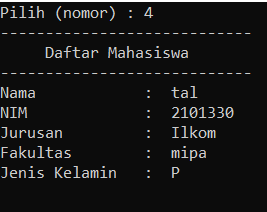

## Janji
Saya Talitha Syahla NIM 2101330 mengerjakan
Soal Latihan 1 dalam mata kuliah Desain Pemrograman Berorientasi Objek untuk keberkahanNya maka saya tidak melakukan 
kecurangan seperti yang telah dispesifikasikan. Aamiin.

# TUGAS LATIHAN 1 DPBO 2023
Buatlah program berbasis OOP menggunakan bahasa pemrograman C++, Java, Python, dan PHP yang menampilkan informasi daftar mahasiswa (sekumpulan objek mahasiswa) dan memiliki fitur menambah, mengubah, dan menghapus data. Setiap mahasiswa memiliki data nama, NIM, program studi, fakultas, dan foto profil (khusus bahasa PHP).

File README ini berisikan design program, penjelasan alur program, dan dokumentasi saat program dirun/dijalankan.

# Design Program
Design pada program disini menggunakan 1 Class, yaitu:

1) Class daftarMhs, yang memiliki atribut:
    - Nama berupa `string`
    - NIM berupa `string`
    - Jurusan berupa `string`
    - Fakultas berupa `string`
    - Jurusan berupa `string`
    - Jenis Kelamin / gender berupa `string`
    - Tanggal Lahir berupa (atribut ini khusus bahasa PHP) `string` 

Class di atas memiliki setter dan getternya masing-masing berdasarkan atributnya

Pada setiap program dapat melakukan CRUD (Create, Read, Update, Delete) data mahasiswa. Untuk melakukan Update dan Delete pada masing-masing bahasa yang dibuat, atribut `NIM` dengan tipe data `string` menjadi Primary Key. Dimana saat user meminta untuk Update atau Delete, maka akan diminta untuk menginput NIM dari data mahasiswa yang dituju.

Penyimpanan Class daftarMhs ini juga menggunakan `list`.

# Alur Program
Semua program mempunyai alur yang sama, kecuali pada program PHP karena inputan nya secara hardcore dari code dan juga memiliki satu tambahan atribut.

- User dapat memilih nomor dari menu yang ditampilkan oleh program di command prompt
    Berikut menu yang ditampilkan :
        Daftar Menu :
        1) Menambah Data Mahasiswa
        2) Mengubah Data Mahasiswa
        3) Menghapus Data Mahasiswa
        4) Melihat Data Mahasiswa
        5) Out / Keluar
- Jika User memilih 1, maka user akan diminta untuk memasukkan inputan berupa atribut-atribut tersebut.
- Jika User memilih 2, maka user akan diminta untuk menginput NIM dari mahasiswa yang akan diganti datanya. Jika ditemukan maka user akan diminta untuk menginput atribut baru.
- Jika User memilih 3, maka user akan diminta untuk menginput NIM dari mahasiswa yang akan dihapus datanya. Jika ditemukan data mahasiswa tersebut akan dihapus.
- Jika User memilih 4, maka program akan menampilkan data mahasiswa yang telah ditambahkan sebelumnya.
- Jika User memilih 5, maka program akan keluar dari menu yang ditampilkan.

# Dokumentasi
### Java

### PHP

### C++

### C++

